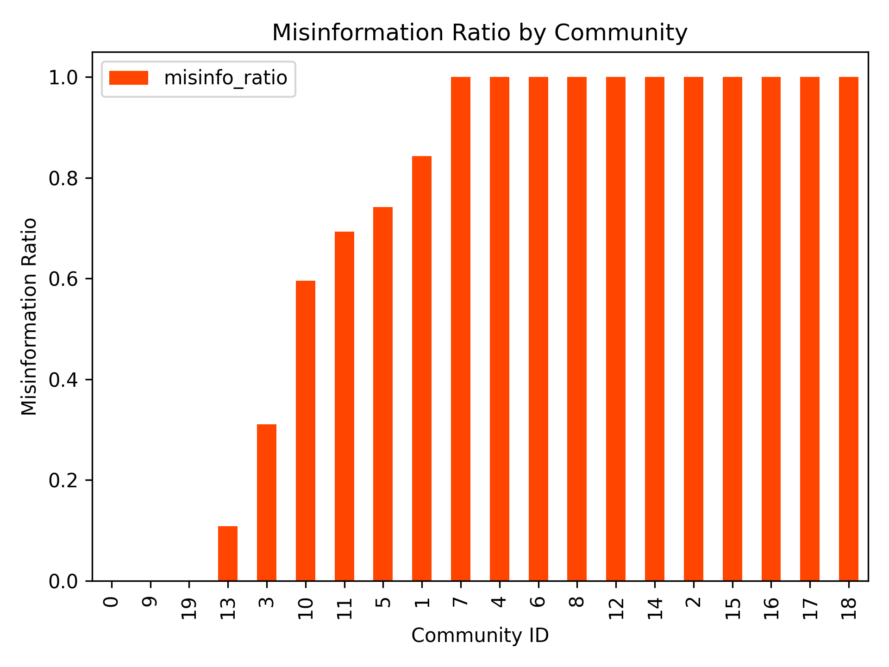
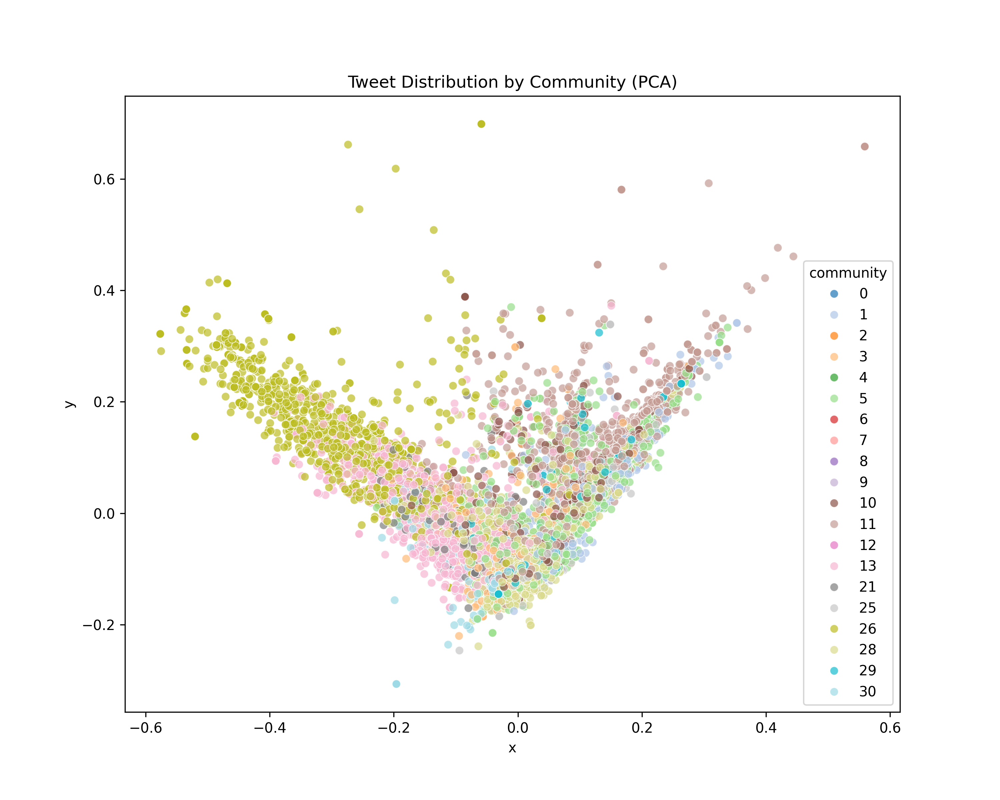
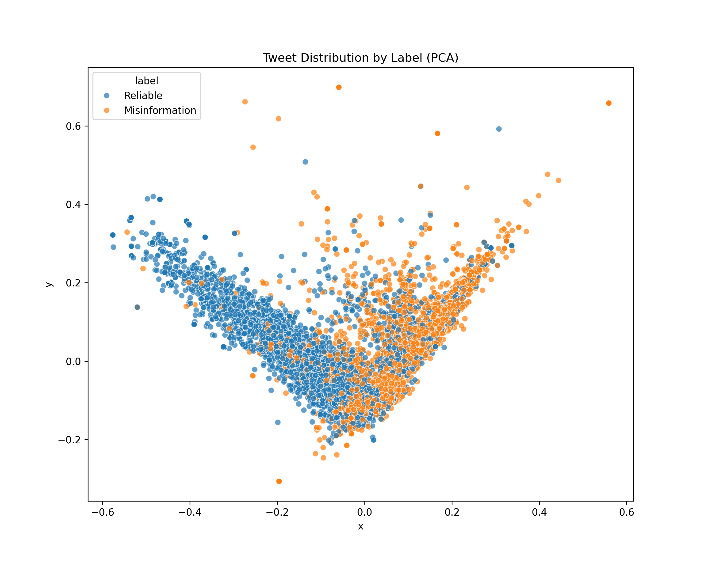

# 🧪 Twitter Misinformation Community Analysis

## 📊 Data Analysis & Results

### 1. Community Detection via Content Similarity

Using TF-IDF vectorization and cosine similarity on tweet content, a similarity graph was constructed where nodes represent tweets and edges connect tweets with high textual similarity (threshold: 0.2). Louvain community detection was then applied to identify clusters of similar tweets.

- **Total tweets analyzed**: 12,900
- **Communities detected**: 33

#### 📌 Figure 1: Tweet Communities Based on Content Similarity


*The visualization above shows the network of tweets where color indicates community membership. Tweets within the same community are semantically similar and form dense clusters.*

---

### 2. Misinformation Distribution Across Communities

We evaluated the prevalence of misinformation across detected communities using provided tweet labels (`Reliable` vs `Misinformation`).

- **Key finding**: Several communities are dominated by misinformation content.

#### 📌 Figure 2: Misinformation Ratio by Community


*This chart reveals the proportion of misinformation within each community. A high ratio suggests strong misinformation presence.*

#### 🔝 Top 10 Communities by Misinformation Ratio:

```
label      Misinformation  Reliable  misinfo_ratio
community                                         
16                    1.0       0.0            1.0
8                     1.0       0.0            1.0
23                    1.0       0.0            1.0
18                    1.0       0.0            1.0
17                    1.0       0.0            1.0
15                    1.0       0.0            1.0
14                    1.0       0.0            1.0
12                    1.0       0.0            1.0
32                    1.0       0.0            1.0
7                     1.0       0.0            1.0
```

This polarization indicates **echo chambers**, where certain clusters heavily propagate only misinformation or reliable content with minimal crossover.

---

### 3. Semantic Structure in 2D (PCA)

To better understand tweet groupings, dimensionality reduction via PCA was applied.

#### 📌 Figure 3: Tweet Distribution by Community (PCA)


*Tweets are grouped in 2D space based on semantic similarity. Color represents the community assignment.*

#### 📌 Figure 4: Tweet Distribution by Label (PCA)


*This plot shows how Reliable and Misinformation tweets are distributed across semantic space. The partial separation indicates thematic divergence between the two.*

---

### 4. Top Communities by Size

The following are the 10 largest communities by number of tweets:

```
28    2756
5     1919
11    1791
13    1410
26    1238
10     941
3      685
1      664
25     585
30     307
```

---

## 🧠 Interpretation

This analysis demonstrates how **content similarity + community detection** reveals the **underlying structure of discourse** on Twitter:

- Communities form **naturally around shared narratives**.
- Misinformation tends to **concentrate** in certain clusters — validating theories of **information silos** and **filter bubbles**.
- This pipeline enables scalable misinformation mapping across large-scale social media data.

---
